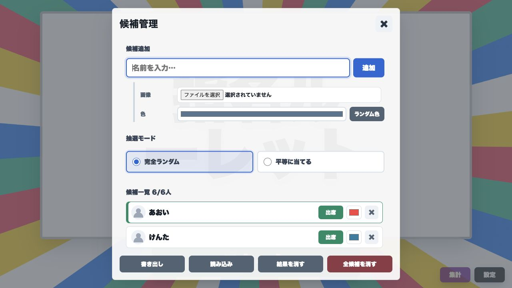
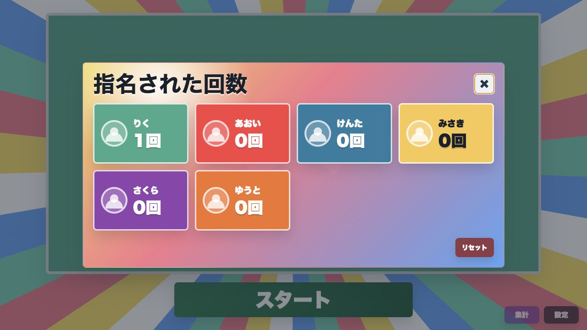

# 指名ルーレット

授業で生徒を指名するためのブラウザ用ルーレットです。

## 使い方

`index.html` をブラウザで開きます。

- `スタート` ボタンまたはスペースキーで開始
- `ストップ` ボタンまたはEnterキーで停止
- `設定` から候補の追加、画像・色の設定、抽選モードの変更、JSONの書き出し/読み込み
- `集計` から指名された回数の確認とリセット

## スクリーンショット

### ルーレット画面

### 候補管理

### 集計

## 主な機能

- 候補名、画像、色の登録
- 完全ランダム / 平等に当てるモードの切り替え
- 欠席者の一時除外
- 指名回数の集計
- JSONによる候補データの書き出し/読み込み
- `se/` 配下の効果音再生

## 保存データ

ブラウザの `localStorage` には、候補一覧、直近結果、抽選モード、指名回数、欠席状態が保存されます。

JSON書き出しには候補マスタだけを含めます。

- `name`
- `image`
- `color`

`hitCount`、`absent`、`textColor`、直近結果、抽選モードはJSONには含めません。

## 効果音

効果音ファイルは `se/` ディレクトリに配置します。HTMLから相対パスで参照しています。

- `start.mp3`: 開始時
- `spin-loop.mp3`: 回転中
- `slow-down.mp3`: 減速中
- `result.mp3`: 結果表示時
